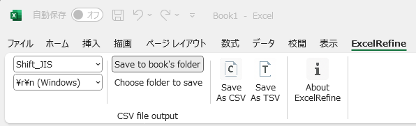

ExcelRefine: Excelの使い勝手の悪さを解消するためのアドイン
===========
[English version is here / 英語版はこちら](./README.md)

[インストールについてはこちら](./distribution/README.ja.md)

### 概要 ###
現在は、CSVおよびTSVファイルをワンクリックで出力する機能を提供しています。
ExcelでのCSV/TSVの保存操作は不要に煩雑なことが多いため、このアドインはその手間を簡略化します。
今後、Excelのさらなる使いづらさに気づいた場合には、機能を追加実装する予定です。

### 主な機能 ###
- CSV / TSV へのワンクリック出力
  - 出力後も元のExcelワークブックは開いたまま
  - デフォルトでは、ワークブックと同じフォルダに、同じファイル名で保存
  - 必要に応じて、保存先フォルダやファイル名を選択可能

### スクリーンショット ###

### なぜExcelRefineを作ったか ###
ExcelでCSV/TSVデータを作成する際に、以下のような点で以前から不便さや不満を感じていました。これらを少しでも解消できれば、わずかな改善であっても、積み重ねによって作業が徐々に楽になると考えたことが、本プロジェクトのきっかけです。
- 保存ダイアログを操作する際に、保存形式（CSVやTSV）を選ぶだけでも長い形式一覧をスクロールしなければならない
- 出力後にワークブックが自動的に閉じられてしまい、ワークブックの編集作業の流れが途切れてしまう

### ヒント ###
- 日付や時刻のセルを出力する際は、ワークブック上で表示形式を文字列型にしてください。文字列型でない場合、Excelがそれらを浮動小数点数に変換してしまい、CSV/TSVに44923.5のような形式で出力されます（例：2023-01-01 12:00 → 44923.5）。