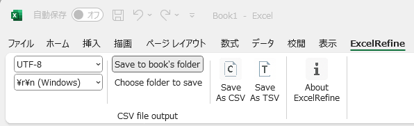

ExcelRefine: An Excel add-in designed to explicitly resolve the usability gaps in Excel’s features
===========
[日本語版はこちら / Japanese version is here](./README.ja.md)

[See here for installation](./distribution/README.md)

### Overview ###
Currently, it provides a one-click export function for CSV and TSV files, streamlining a process that is often unnecessarily tedious.  Additional features may be implemented in the future as more usability gaps in Excel are identified.

### Key features ###
- One-click export to CSV / TSV
  - Keeps the original Excel workbook open after export
  - By default, saves the output file in the same folder as the workbook, using the same base name
  - Folder and file name can be specified when needed, allowing explicit control over output location and naming

### Screenshot ###

### Why ExcelRefine ###
This project began from a quiet frustration: the following recurring inconveniences when creating CSV/TSV data in Excel. By resolving even a few of them, I hoped to make things a little easier—small improvements that quietly accumulate over time.
- Repetitive dialog interactions every time you save, including having to scroll through a long list of file formats just to select CSV or TSV
- The workbook closes automatically after exporting, which disrupts the editing flow and feels intrusive

### Tips ###
- When exporting date or time cells, make sure they are formatted as text in the workbook.  Otherwise, Excel may convert them to floating-point numbers in the CSV/TSV output (e.g., 44923.5 instead of 2023-01-01 12:00).